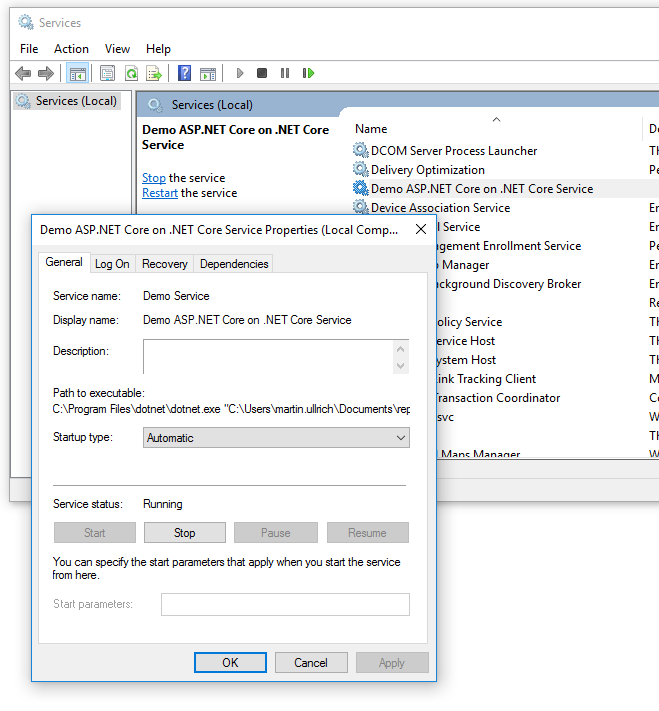
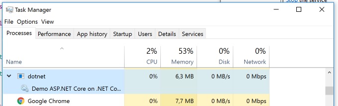

# .NET Standard-based Windows Service support for .NET

This repo contains a library for running a .NET Core application as Windows service without
the need for a wrapper assembly or the full (desktop) .NET Framework.
It is built using P/Invoke calls into native Windows assemblies.

Usage scenarios include:
* Running on Windows Nano Server (no full framework but can run Windows services)
* Shipping a modern service application using the latest .NET Core version to systems
  where you cannot upgrade to new versions of .NET, but you want to use new framework features.
* Build truly portable applications that can for example run as service on Windows and as daemon on Linux,
  just using runtime checks / switches

## How to use the example application
Prerequisites:
* .NET Core SDK 2.0.3 or higher (`.csproj` based tooling)
* Windows machine
* **Elevated command prompt**: Run cmd as administrator.
```cmd
> cd samples\TestService
> dotnet restore
> dotnet run --register-service --urls http://*:5080
...
Successfully registered and started service "Demo .NET Core Service" ("Demo ASP.NET Core Service running on .NET Core")
```
Open `http://localhost:5080` in a browser. You should see `Hello world`.

The "Services" administrative tool should show the service:



```cmd
> dotnet run --unregister-service
...
Successfully unregistered service "Demo .NET Core Service" ("Demo ASP.NET Core Service running on .NET Core")
```
The service may show up as `disabled` for some time until all tools accessing the Windows services APIs have been closed.
See this [Stack Overflow question](http://stackoverflow.com/questions/20561990/how-to-solve-the-specified-service-has-been-marked-for-deletion-error).

## API

Add a NuGet package reference to `DasMulli.Win32.ServiceUtils`.

Write a Windows service using:

```c#
using DasMulli.Win32.ServiceUtils;

class Program
{
    public static void Main(string[] args)
    {
        var myService = new MyService();
        var serviceHost = new Win32ServiceHost(myService);
        serviceHost.Run();
    }
}

class MyService : IWin32Service
{
    public string ServiceName => "Test Service";

    public void Start(string[] startupArguments, ServiceStoppedCallback serviceStoppedCallback)
    {
        // Start coolness and return
    }

    public void Stop()
    {
        // shut it down again
    }
}
```

You can then register your service via sc.exe (run cmd / powershell as administrator!):

`sc.exe create MyService DisplayName= "My Service" binpath= "C:\Program Files\dotnet\dotnet.exe C:\path\to\MyService.dll --run-as-service"`

Now go to Services or Task Manager and start your service.

`sc` will install your service as `SYSTEM` user which has way to many access rights to run things like web apps.
See [its reference](https://technet.microsoft.com/en-us/library/cc990289(v=ws.11).aspx) for more options.

If you want to get rid of it again, use:

`sc.exe delete MyService`

You can also create a service that registers itself like the example provided by
taking a look at [the sample source](./samples/TestService/Program.cs).

Also take a look at the [ASP.NET Core MVC sample](./samples/MvcTestService) which has additional logic to set the correct working directory.
When running it in development and not from the published output, be sure to pass `--preserve-working-directory` to it when registering
so that it will run from the project directory (e.g. run `dotnet run --register-service --preserve-working-directory` from and administrative
command prompt).

## Pause & Continue support

To create a service that supports being paused and later continued or stopped, implement `IPausableWin32Service` which extends `IWin32Service` by `Pause()` and `Continue()` methods
you can use to implement your pause & continue logic.

## Limitations

* No custom exceptions / error codes. Everything will throw a `Win32Exception` if something goes wrong (Its message should be
  interpretable on Windows).
* All exceptions thrown by the service implementation will cause the service host
  to report exit code -1 / 0xffffffff to the service control manager.
* Currently, no direct support for services supporting commands such as power event and system shutdown
  * However, consumers can now use `IWin32ServiceStateMachine` to implement custom behavior.
    Copy `SimpleServiceStateMachine` as a starting point to implement extended services.
